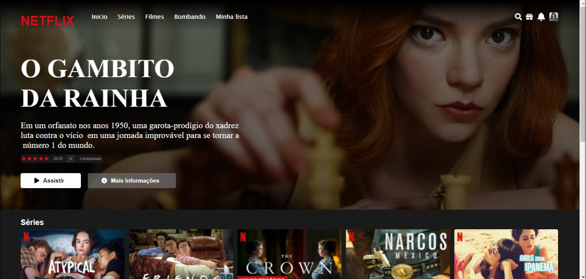

# 


## Instalação

```
$ git clone https://github.com/ThaisaAndrade2/Bootcamp-Netflix.git
```

## Descrição
Este projeto foi realizado no Bootcamp da Digital Innovation One patrocinado pela Everis, recriamos a página inicial da Netflix utilizando as tecnologias de desenvolvimento front end (HTML, CSS, JavaScript)

